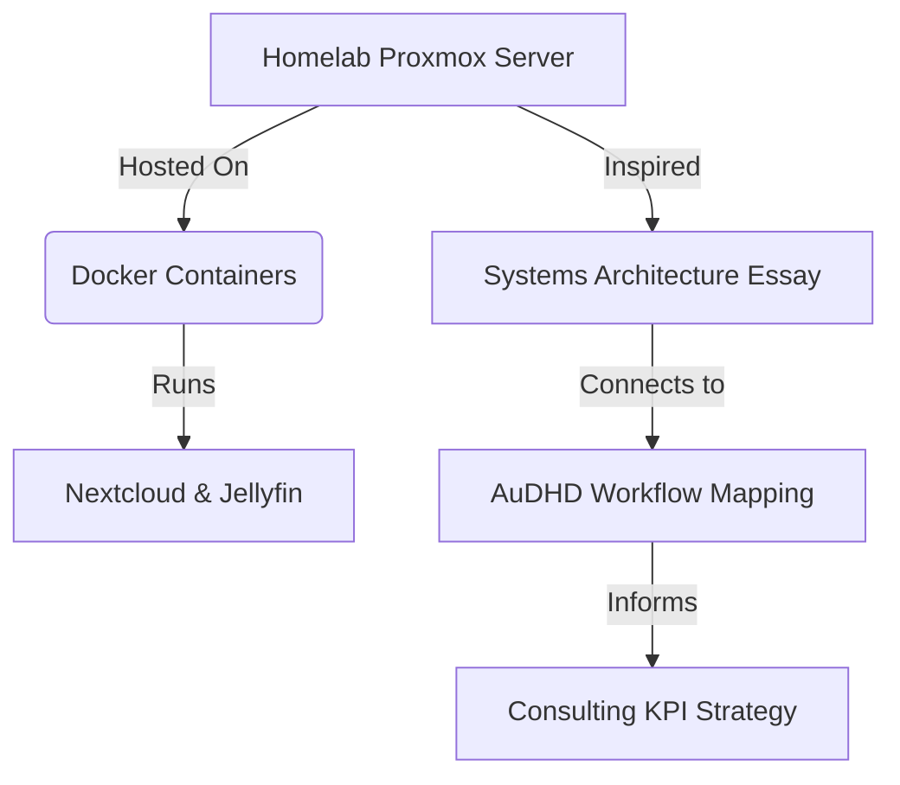

# The Project Atlas Manifesto

> *"I am large, I contain multitudes."* — Walt Whitman

Standard portfolio websites and blogs are fundamentally broken. They are linear, chronological, and sanitized. They treat human experience like a corporate brochure: here is my bio, here is my GitHub, here is my polished professional history. 

But my brain doesn't work like a brochure. It works like a web.

## The AuDHD Architecture

I built **Project Atlas** because standard platforms couldn't capture the connective tissue of an AuDHD mind. My hyper-focus doesn't respect the artificial boundaries of a resume or a standard blog category. 

When you have a brain that thrives on systems thinking, a late-night deep dive into fixing a Docker container in the homelab isn't isolated from a philosophy essay I read three weeks ago. The methodology of mapping out a network topology for a remote resort directly informs how I build a 100% completion tracker for a 25-year-old video game. 

**Everything is connected.** 

> [!NOTE]
> This isn't just a metaphor. This site is powered by a custom static-site generator and a relational graph database that mechanically binds ideas together. 

## Dropping the Silos

Social media forces us into silos. X is for fleeting thoughts. LinkedIn is for corporate networking. Spotify is for music. But none of them capture the intersection.

Instead of fighting the chaos, I decided to build a digital garden to map it. Every article, every piece of software I've written, every book I've read, and every tool I use is a **node**. Every relationship between them is an **edge**. 

- If I write an article about AI infrastructure, it connects directly to the Python projects I've built.
- If I review a sci-fi book, it connects to the themes of futurism and the video games I play.
- If you look at my Resume, you aren't just seeing a list of jobs—you are seeing the hub that connects to the actual open-source projects I shipped during those roles.

## How to Explore

When you interact with the 3D graph or the nodes on this site, you are flying through a raw projection of my interests. 

There is no prescribed path. You might start by clicking on a node about baseball trend analytics, follow an edge to a piece of Python data-scraping architecture, and end up reading about sensory-friendly workspace setups. 

> [!TIP]
> **Don't read this site chronologically.**
> Pick a node that interests you, open the side panel, and follow the **Connected Content** down the rabbit hole. 

## Project Atlas Roadmap (Timeline Preview)

While the vision for this graph is sprawling, the rollout is structured. Here is the current plan for bringing the full Atlas online:

- **Phase 1: Interactive Tool Beta (Currently Live)**
  Testing the static site generator, Web Audio APIs, and data visualization integrations. You can explore the early tools directly from the homepage.
- **Phase 2: Building Project Atlas (Next Drop)**
  The first major content release. This will include a batch of long-form articles detailing exactly how I built this digital garden from the ground up, including the AI-agent orchestration running behind the scenes.
- **Phase 3: The Full Knowledge Graph (Future)**
  Connecting the entire 66+ article backlog of systems thinking, tech tutorials, and neurodivergent mapping into a fully realized 3D interactive web.

Welcome to the Atlas.
